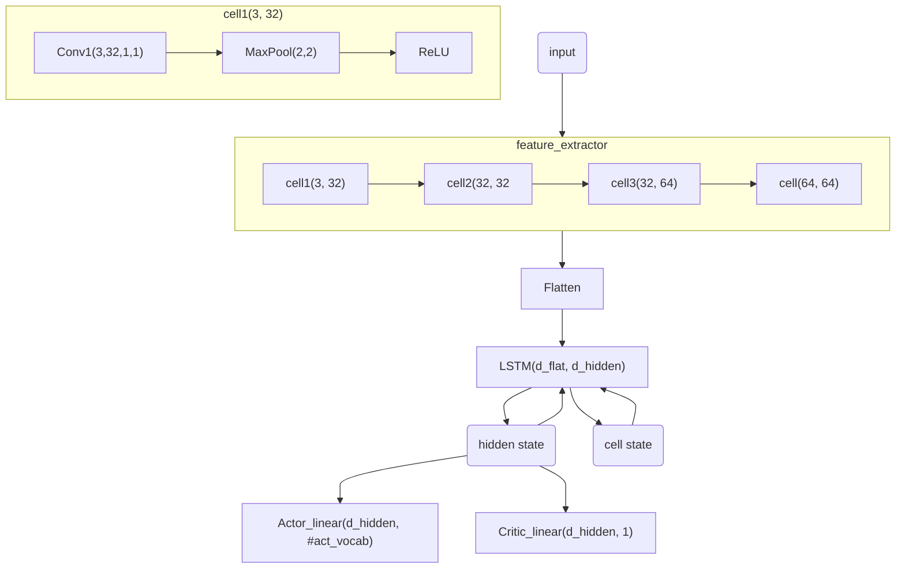

# actor_critic.py

## ActorCritic

<strong>Chart</strong>

```mermaid

%%{init: {"flowchart": {"htmlLabels": false}} }%%
%%{ init: { 'flowchart': { 'curve': 'monotoneY' } } }%%

flowchart TB
    in("input") --> feature_extractor
    subgraph "feature_extractor"
        cell1["cell1(3, 32)"] --> cell2["cell2(32, 32"] --> cell3["cell3(32, 64)"] --> cell4["cell(64, 64)"]
    end
    
    subgraph "cell1(3, 32)"
        conv1["Conv1(3,32,1,1)"] --> pool1["MaxPool(2,2)"]-->relu1["ReLU"]
    end
    
    feature_extractor --> flat["Flatten"] --> lstm["LSTM(d_flat, d_hidden)"]
    
    hx("hidden state") --> lstm --> hx
    cx("cell state") --> lstm --> cx
    hx --> actor["Actor_linear(d_hidden, #act_vocab)"]
    hx --> critic["Critic_linear(d_hidden, 1)"]
    
```

