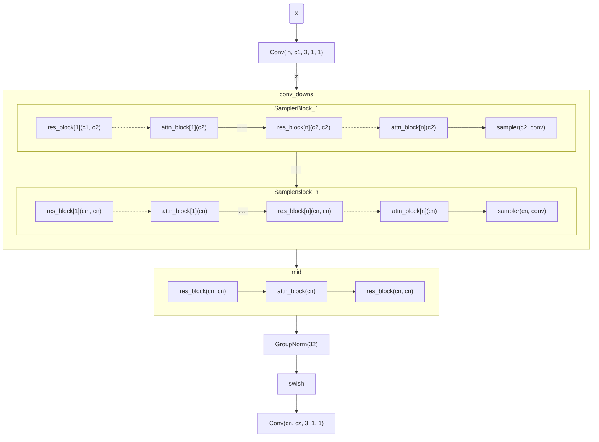
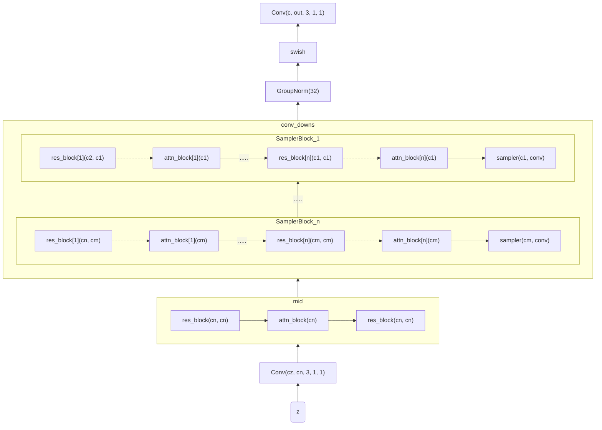
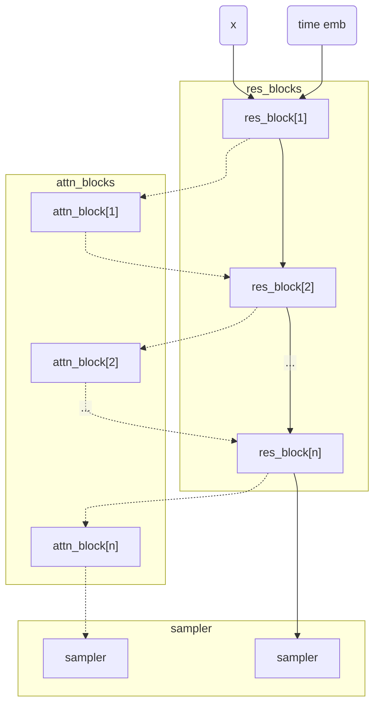
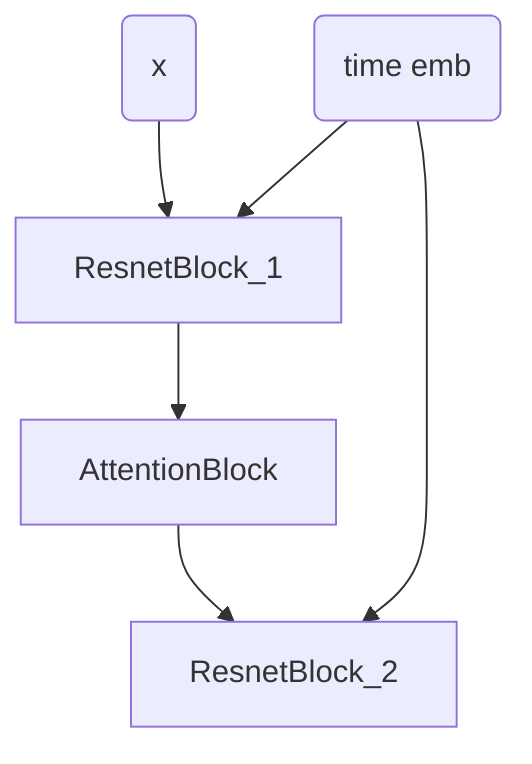
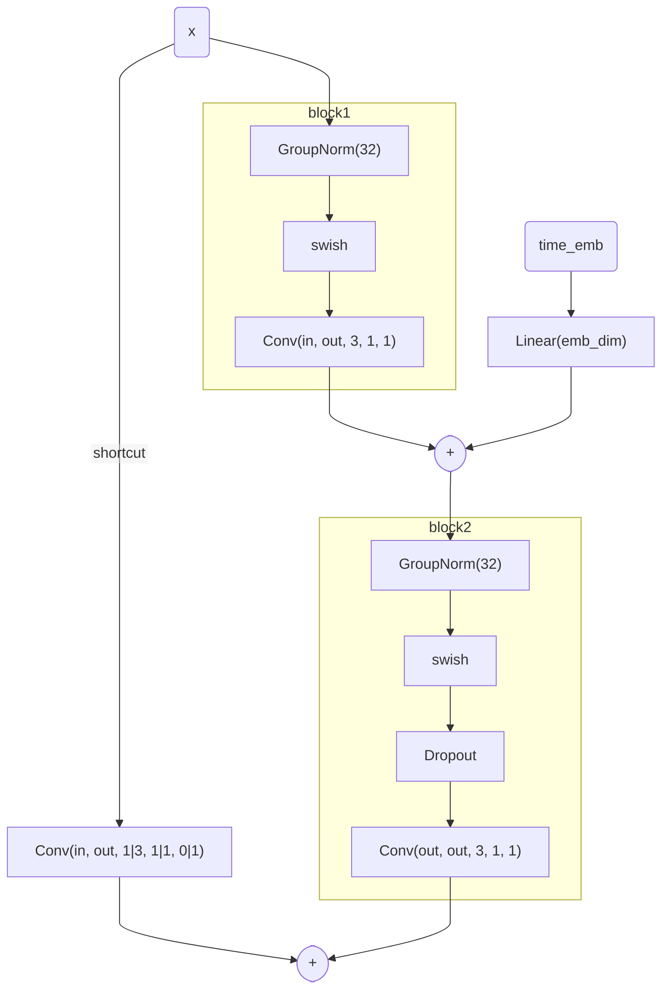
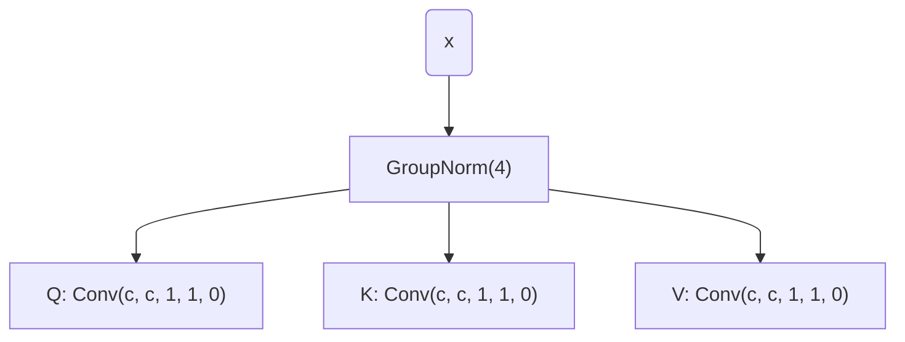
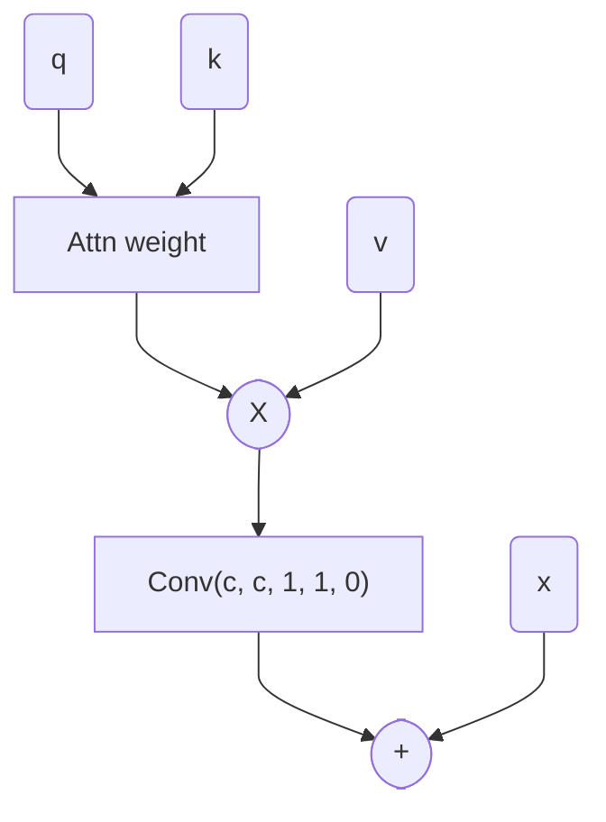
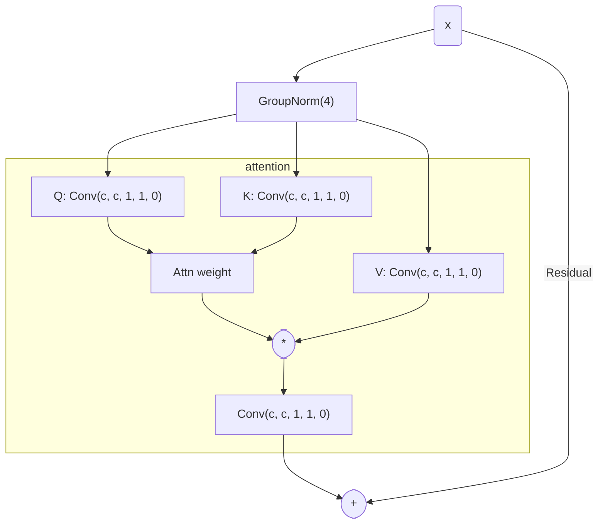

# [nets.py](/home/bluesun/PycharmProjects/research/iris/src/models/tokenizer/tokenizer.py)

## Encoder

<strong>Chart</strong>

## Decoder

<strong>Chart</strong>

**Note That this is similar with reverse of Encoder**

## Common Blocks

<h3 id="sampler-block"><code>SamplerBlock</code></h2>

`x`와 time embedding `time_emb`를 받아서 resnet block과 attention block을 통해 feature를 추출하고
이를 sampler로 up/down sampling 한다.

<strong>Chart</strong>

<h3 id="midblock"><code>MidBlock</code></h3>
Middle block for the encoder and decoder, which has `resnet` -> `attention` -> `resnet` structure.

<strong>Chart</strong>

<h3 id="resblock"><code>ResnetBlock</code></h3>

<strong>Chart</strong>

<h3 id="attnblock"><code>AttentionBlock</code></h3>

<strong>Chart</strong>

**Quary Key Value**

**Attention**
- $z\in \R^{B\times c\times h\times w}$
- $q,k,v\in \R^{B\times c\times h\times w}$
- $\bar q, \bar k \bar v= \text{flat}(q, 2), \text{flat}(k, 2), \text{flat}(v, 2)\in\R^{B\times c\times hw}$

$$ \therefore \mathbf{a} = {\mathbf{q}^T\mathbf{k} \over \|\mathbf{q}\|}={\mathbf{q}\cdot\mathbf{k}\over hw} \in \R^{B\times hw\times hw}=\text{sim}(q_i, k_j)$$

$$ \mathbf{z} = \mathbf{a}\mathbf{v}^T \in \R^{B\times hw\times c}$$

**Projection & Residual**

**Total Flow**

<h3 id="samplers">Sample Networks</h3>

- **`Upsample`**
    1. `F.interpolate`를 통해 2배로 upsampling 한다.  
    2. (Optional) `with_conv=True`일 경우, `Conv2d`를 통해 feature post-processing을 한다.

- **`Downsample`**
    - 만약 `with_conv=True`일 경우, `Conv2d(c, c, 3, 2, 0)`을 통해 2배로 downsampling 한다.
    - 만약 `with_conv=False`일 경우, `F.avg_pool2d(2, 2, 0)`를 통해 2배로 downsampling 한다.

<h2 id="Others">Others</h2>

<h3 id="swish">Swish</h3>

$$
\begin{aligned}
    \text{swish}(x) = x \cdot \sigma(x)
\end{aligned}
$$
